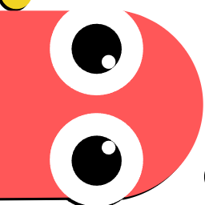
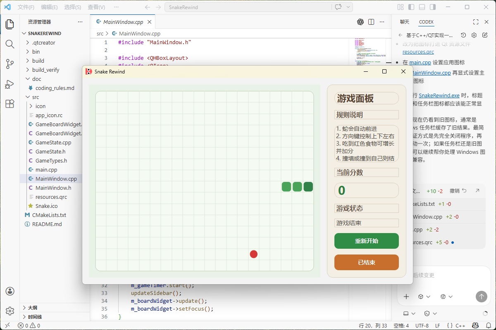

<div align="center">
  

# SnakeRewind

> 完全由 **Codex** 生成的 C++ / Qt 贪吃蛇桌面项目（代码、结构与文档均由 Codex 驱动完成）。


</div>

## 项目简介

`SnakeRewind` 是一个基于 **Qt Widgets + C++17** 的轻量桌面小游戏，聚焦于清晰架构与稳定交互体验。项目实现了经典贪吃蛇核心机制，并保持了良好的模块边界，适合作为：

- Qt/C++ 桌面项目入门示例
- 面向对象与状态管理练习项目
- CMake + Qt 工程组织参考

## 运行截图

<div align="center">
  
</div>

## 功能亮点

- 方向键控制蛇移动（防止反向穿身）
- 食物随机生成与吃食增长逻辑
- 撞墙/撞身判定与游戏结束弹窗
- 实时分数显示
- 暂停 / 继续 / 重新开始
- UI 与游戏状态逻辑解耦

## 架构设计

项目遵循“状态层 + 渲染层 + 容器层”的分层设计：

- `GameState`：维护游戏核心状态（蛇身、方向、食物、得分、暂停、碰撞检测）
- `GameBoardWidget`：负责棋盘绘制与键盘输入采集
- `MainWindow`：负责窗口布局、侧边信息区、按钮交互与定时驱动

这种设计让规则逻辑和界面表现分离，后续扩展（例如难度等级、关卡模式、主题皮肤）会更容易。

## 目录结构

```text
SnakeRewind/
├─ bin/                  # 构建产物输出目录（exe/pdb）
├─ doc/                  # 文档与截图
├─ src/
│  ├─ icon/Snake.png     # 项目图标
│  ├─ main.cpp
│  ├─ GameTypes.h
│  ├─ GameState.h
│  ├─ GameState.cpp
│  ├─ GameBoardWidget.h
│  ├─ GameBoardWidget.cpp
│  ├─ MainWindow.h
│  ├─ MainWindow.cpp
│  ├─ resources.qrc
│  └─ app_icon.rc
├─ CMakeLists.txt
├─ LICENSE
└─ README.md
```

## 快速开始

### 1. 环境要求

- CMake `>= 3.16`
- Qt `6.x`（需包含 `Qt6::Widgets`）
- 支持 C++17 的编译器（推荐 MSVC）

### 2. 构建

在项目根目录执行：

```powershell
cmake -S . -B build
cmake --build build --config Debug
```

### 3. 运行

```powershell
.\\bin\\SnakeRewind.exe
```

## 操作说明

- `↑ ↓ ← →`：控制移动方向
- `暂停`：暂停/继续游戏
- `重新开始`：重置当前对局

## 开发说明

- 项目未使用 `.ui` 文件，界面全部通过 Qt Widgets 代码构建
- 构建输出统一落在 `bin/` 目录
- 代码规范参考 [`doc/coding_rules.md`](doc/coding_rules.md)

## Roadmap

- 增加速度等级与难度曲线
- 增加最高分持久化
- 增加音效与主题切换
- 增加跨平台打包配置

## License

本项目采用 [MIT License](LICENSE)。